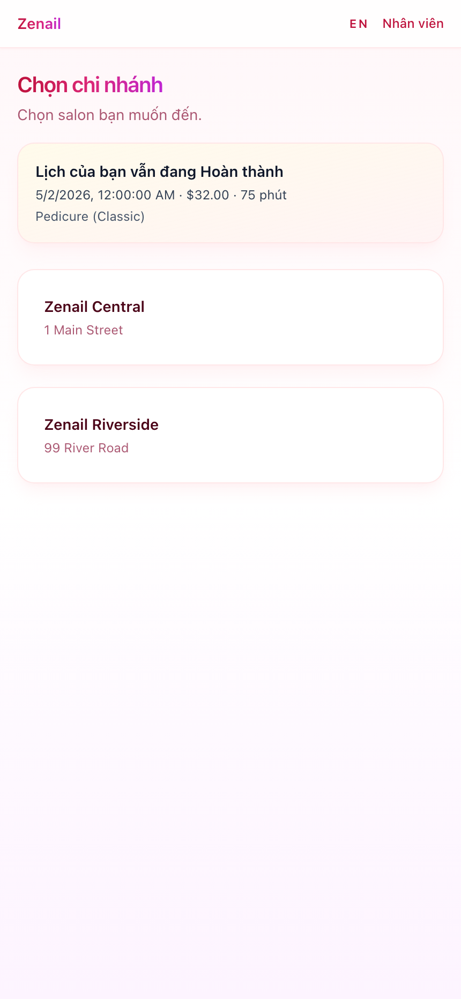
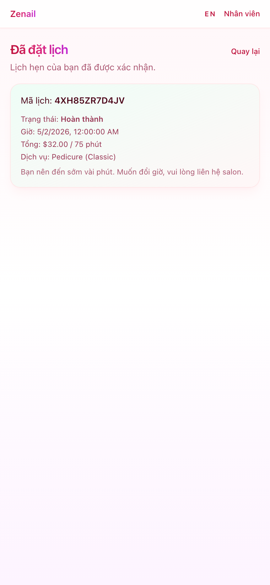
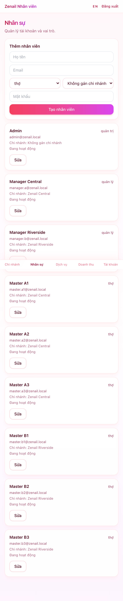
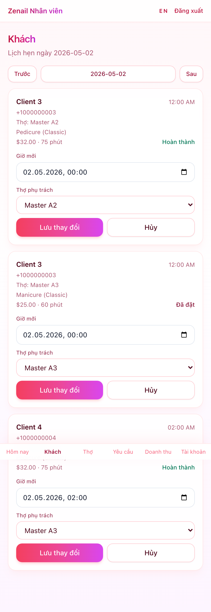
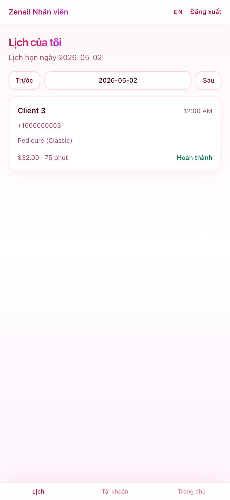

# Zenail CRM

Zenail là hệ thống CRM và đặt lịch cho tiệm nail nhiều chi nhánh, tối ưu cho giao diện mobile-first. Dự án gồm luồng đặt lịch cho khách và khu vực vận hành riêng cho `admin`, `manager`, `master`.

## Tổng quan

### Luồng khách hàng

- Chọn chi nhánh
- Chọn dịch vụ
- Chọn thợ
- Chọn khung giờ còn trống
- Xác nhận đặt lịch
- Xem lại lịch hẹn bằng `booking_reference`

### Luồng nhân viên

- `admin`: quản lý chi nhánh, nhân sự, dịch vụ, doanh thu, yêu cầu dời lịch
- `manager`: quản lý lịch hẹn theo chi nhánh, thợ, doanh thu, yêu cầu dời lịch
- `master`: xem lịch cá nhân, chi tiết cuộc hẹn, cập nhật tài khoản

## Tính năng chính hiện có

- Đặt lịch công khai cho khách
- Quản lý nhiều chi nhánh
- Hỗ trợ nhiều dịch vụ trong một lịch hẹn
- Lookup lịch hẹn bằng `booking_reference` thay vì `appointment_id + phone`
- Hỗ trợ múi giờ theo từng chi nhánh
- Kiểm tra xung đột lịch tập trung trong backend
- Đăng nhập JWT cho nhân viên
- Chuyển ngôn ngữ Việt / Anh ở frontend
- Manager và master có thể tự sửa email, số điện thoại, mật khẩu
- CI chạy backend tests + frontend lint/build

## Công nghệ sử dụng

### Backend

- FastAPI
- SQLAlchemy
- Alembic
- PostgreSQL

### Frontend

- React
- Vite
- TypeScript
- React Router
- React Hook Form

## Cấu trúc chính

```text
backend/
  app/
    routers/      # auth, public, admin, manager, master
    models/       # appointment, branch, staff, procedure...
    schemas/      # request/response schemas
    services/     # booking logic, output mapping
    scripts/      # seed data
frontend/
  src/
    pages/        # guest + staff pages
    layouts/      # guest/staff layouts
    state/        # auth, i18n, booking state
    api/          # typed API client
```

## Ảnh minh họa

### Screenshot tính năng chính

#### 1. Khách chọn chi nhánh và xem lịch gần nhất



#### 2. Khách xem chi tiết lịch đã đặt



#### 3. Admin quản lý nhân sự



#### 4. Manager quản lý lịch hẹn khách



#### 5. Master xem lịch cá nhân



## Chạy local bằng Docker

Điều kiện:

- Docker Desktop

### 1. Tạo file env

```bash
cp backend/.env.example backend/.env
cp frontend/.env.example frontend/.env
```

### 2. Chạy toàn bộ stack

```bash
docker compose up --build
```

Sau khi chạy:

- Frontend: `http://localhost:5173`
- Backend API: `http://localhost:8000`
- Swagger docs: `http://localhost:8000/docs`
- Postgres: `localhost:5432`

## Seed dữ liệu demo

Sau khi container đã lên:

```bash
docker compose exec backend uv run python -m app.scripts.seed
```

### Tài khoản demo

- Admin: `admin@zenail.local` / `admin123`
- Manager chi nhánh A: `manager.a@zenail.local` / `manager123`
- Manager chi nhánh B: `manager.b@zenail.local` / `manager123`
- Master: `master.*@zenail.local` / `master123`

### Dữ liệu seed hiện có

- 2 chi nhánh:
  - `Zenail Central`
  - `Zenail Riverside`
- Nhiều thợ theo từng chi nhánh
- Nhiều dịch vụ manicure / pedicure / add-on
- Lịch hẹn mẫu để test dashboard và schedule

## Chạy backend không dùng Docker

```bash
cd backend
uv sync
uv run uvicorn app.main:app --reload
```

## API và hành vi đáng chú ý

### Endpoint chính

- `GET /health`
- `POST /api/auth/login`
- `GET /api/branches`
- `GET /api/availability`
- `POST /api/appointments`
- `GET /api/appointments/by-reference/{booking_reference}`
- `GET /api/me`
- `PATCH /api/me`

### Điểm quan trọng

- Logic đặt lịch nằm chính trong `backend/app/services/booking.py`
- Mỗi chi nhánh có `timezone`, `open_time`, `close_time`
- Frontend staff chờ xác thực `/api/me` trước khi render route bảo vệ
- Manager không được chuyển thợ sang chi nhánh khác ngoài phạm vi cho phép

## CI

Workflow GitHub Actions hiện chạy:

- Backend tests
- Frontend lint
- Frontend build

File cấu hình:

- `.github/workflows/ci.yml`

## Trạng thái hiện tại

- Backend test đang pass
- Frontend lint và build đang pass
- CI GitHub Actions đang xanh
- Frontend live trên `:3002` từng chạy theo kiểu Vite dev server, nên vẫn đáng cân nhắc harden deployment production

## File nên đọc đầu tiên

### Backend

- `backend/app/main.py`
- `backend/app/routers/public.py`
- `backend/app/routers/admin.py`
- `backend/app/routers/manager.py`
- `backend/app/routers/master.py`
- `backend/app/services/booking.py`
- `backend/app/scripts/seed.py`

### Frontend

- `frontend/src/App.tsx`
- `frontend/src/state/auth.tsx`
- `frontend/src/state/i18n.tsx`
- `frontend/src/pages/guest/`
- `frontend/src/pages/staff/admin/`
- `frontend/src/pages/staff/manager/`
- `frontend/src/pages/staff/master/`
